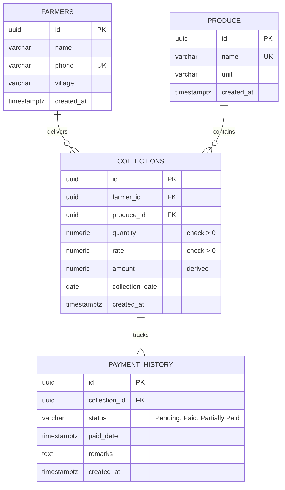

# Database Design: ER Diagram & Relationships Justification

## Entity Relationship (ER) Diagram

The following Mermaid diagram represents the schema entities, primary keys, foreign keys, and cardinalities:

---

## Relationships Description
1. **Farmers to Collections (One-to-Many):** One farmer can make multiple produce collections/deliveries over time. This relationship is enforced by `collections.farmer_id` referencing `farmers.id` with `ON DELETE CASCADE` (if a farmer profile is deleted, all their delivery logs are purged).
2. **Produce to Collections (One-to-Many):** A collection entry refers to exactly one crop type (like Tomato or Banana). This is enforced by `collections.produce_id` referencing `produce.id` with `ON DELETE RESTRICT` (to prevent deleting a crop type that has existing transaction history).
3. **Collections to Payment History (One-to-Many):** A single delivery can transition between payment status states (e.g., from 'Pending' to 'Paid'). Each change writes a new auditable record into `payment_history` referencing `collections.id` with `ON DELETE CASCADE`.

---

## Design Justification

### Why split tables rather than packing everything in one table?
1. **Normalization & Data Integrity:** Storing farmer profiles, crop info, and transaction records separately avoids duplicate entry updates (e.g. if a farmer changes their phone number, it only updates in one place, avoiding history mismatch).
2. **Auditable Status Ledger:** Standard platforms overwrite the `payment_status` column in the collections table directly. However, to comply with Task 2 logic, we write updates to a separate `payment_history` table. An overwritten column only shows the *current state*. A history table answers critical business questions:
   * *When was this delivery settled?*
   * *Were there multiple dispute remarks written on this transaction?*
   * *How long does the payment cycle typically take for different villages?*
3. **Performance Optimization:** Creating index fields on query items like `collection_date`, `farmer_id`, and `payment_status` ensures database queries stay fast as transaction records grow into thousands.
